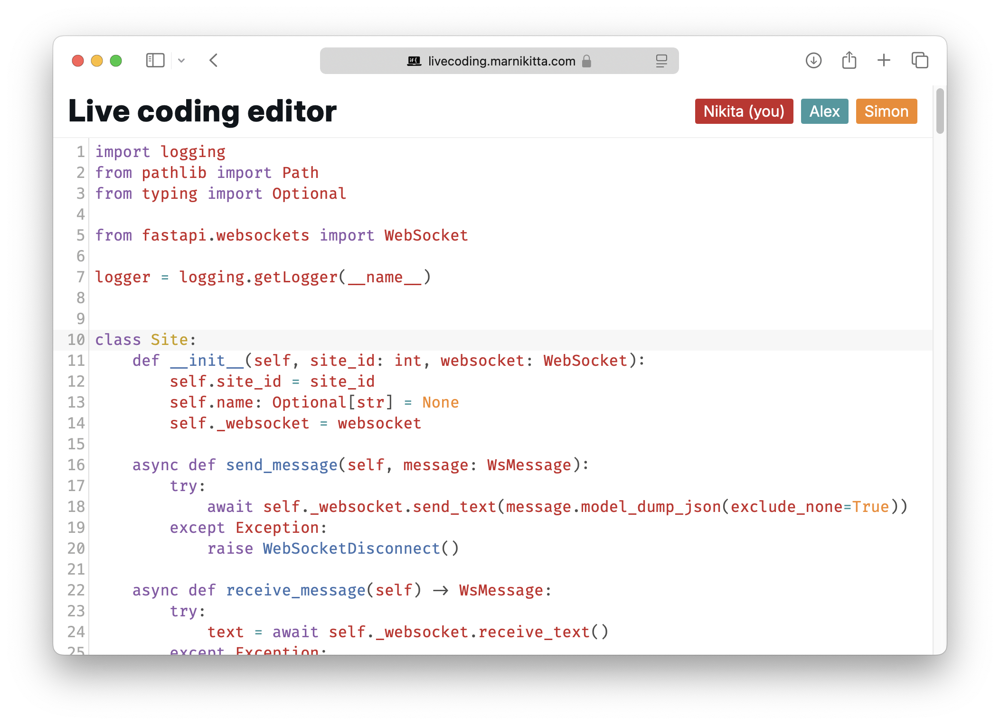

# Live Coding Editor

A minimalist, collaborative code editor for interviews.
Try it out here: [livecoding.marnikitta.com](https://livecoding.marnikitta.com)



There are many editors for coding interviews. However, when I started looking for one, they all came bloated with
features I didn't need: compilers, code completion, prepackaged exercises, and now AI assistants.
So, I built one. It has two features: collaborative editing and code highlighting — nothing more.

The project was inspired by [code.yandex-team.ru](https://code.yandex-team.ru).

#### Build with

- [Vue.js](https://vuejs.org/)
- [esbuild](https://esbuild.github.io/)
- [FastAPI](https://fastapi.tiangolo.com/)
- [CodeMirror](https://codemirror.net/)
- [FiraCode](https://github.com/tonsky/FiraCode)

I tried to minimize build steps and dependencies, so I used Vue.js without `*.vue` files. Check out Julia Evans’ article
on [Writing JavaScript without a build system](https://jvns.ca/blog/2023/02/16/writing-javascript-without-a-build-system/).

For CSS and HTML layout and design, I drew inspiration from [37signals.com](https://37signals.com). Their site was built
without build systems, and the source code is clean and readable.

Collaborative editing is implemented from scratch using a CRDT Replicated Growable Array algorithm. See [Bartosz Sypytkowski's primer on CRDTs](https://www.bartoszsypytkowski.com/operation-based-crdts-arrays-1).

The backend is written in Python with FastAPI. It serves static files and handles WebSocket connections.

## Getting started

#### Prerequisites

- [npm](https://www.npmjs.com/) for frontend dependencies
- [Poetry](https://python-poetry.org/) for Python dependency management
- Python 3.12 or higher
- [Make](https://www.gnu.org/software/make/manual/make.html) for build and install scripts

#### Local development

1. Install prerequisites

2. Run the application

```bash
make run
```

This command installs dependencies, builds the frontend, and starts the backend server. The server will be available
at http://localhost:5000.
The Python backend serves static files from the `frontend` directory, so no separate frontend server is needed.

If you want to apply changes to the frontend in real time, run:

```bash
make watch-frontend
```

This command will start a watcher that updates `frontend/public/bundle.js` on-the-fly.

## Deployment

[livecoding.marnikitta.com](https://livecoding.marnikitta.com) is deployed on a VPS.
The backend service is managed by systemd. I followed
[Writing a systemd Service in Python](https://github.com/torfsen/python-systemd-tutorial) article.
The frontend is served via nginx. It also acts as a reverse proxy for the backend. HTTPS is provided by Let's Encrypt.

This setup is inspired by [How I run my servers](https://blog.wesleyac.com/posts/how-i-run-my-servers) article.

nginx configuration and unit file are not included in this repository.

To build the frontend for production:

```bash
make build-frontend
```

It will create a minified `frontend/public/bundle.js`.